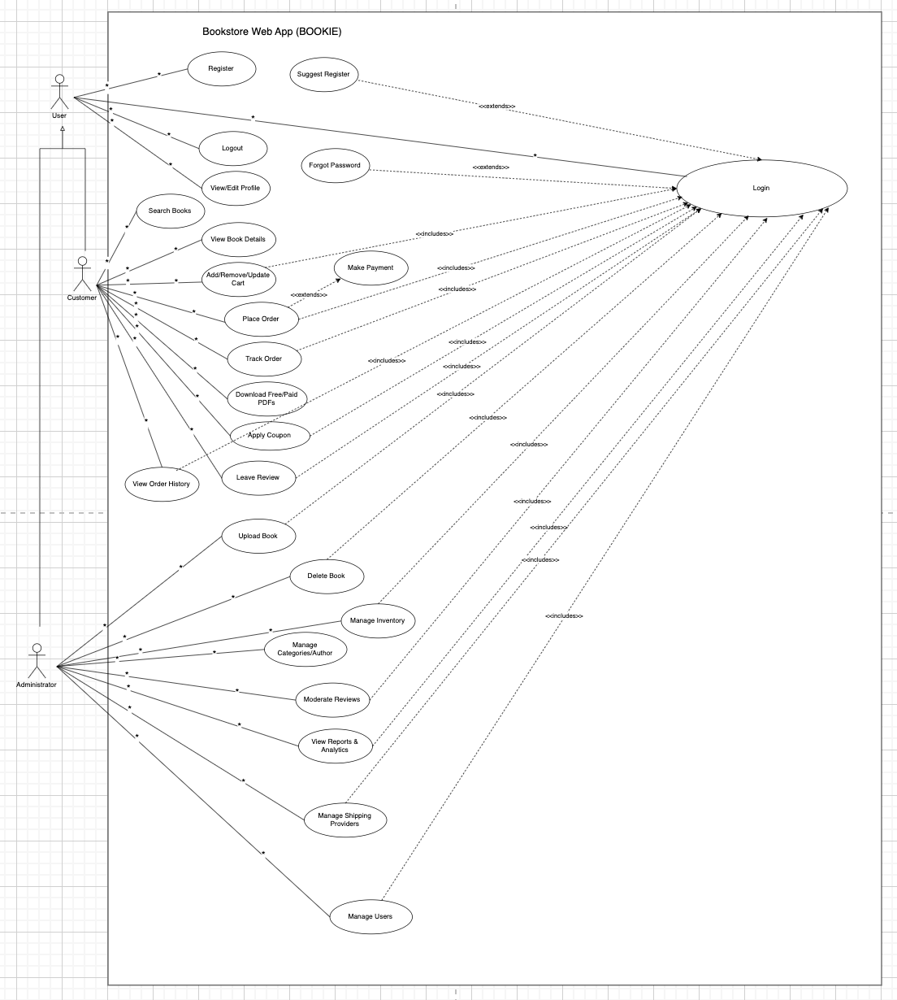
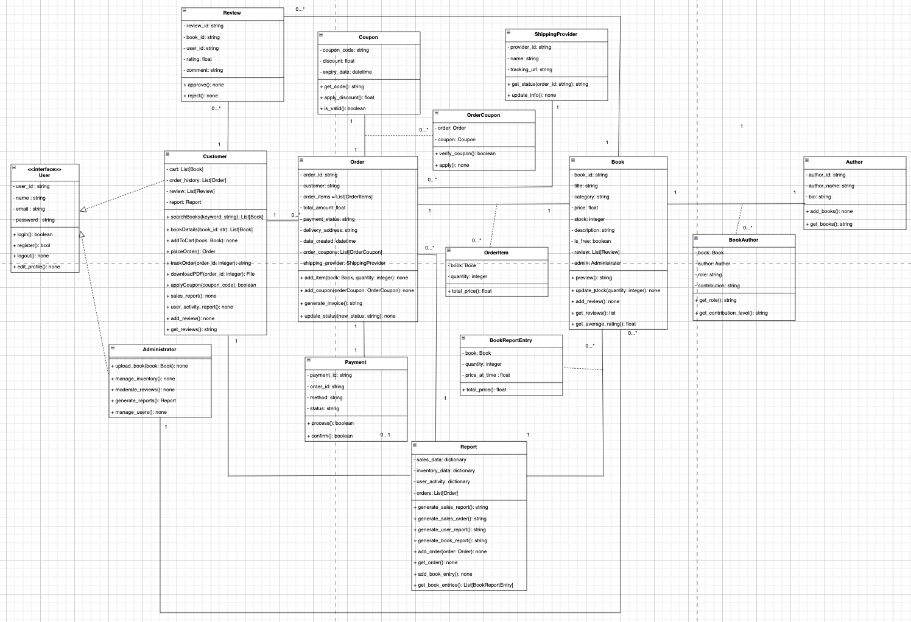
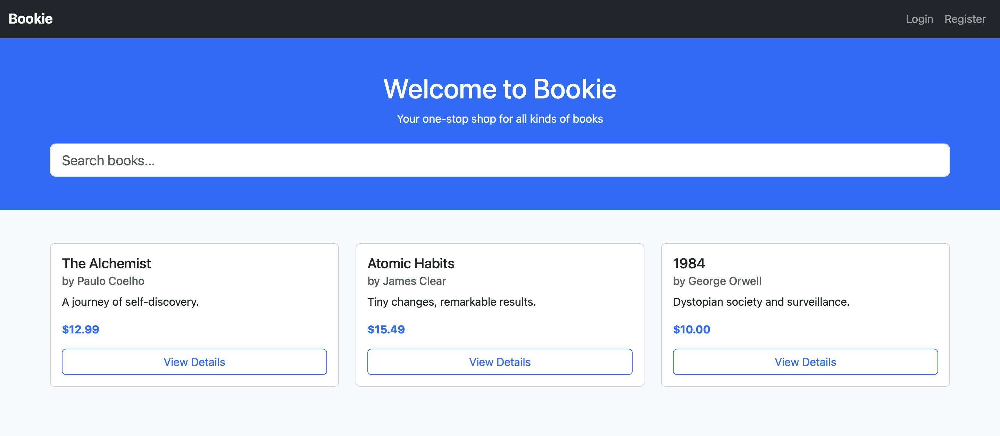
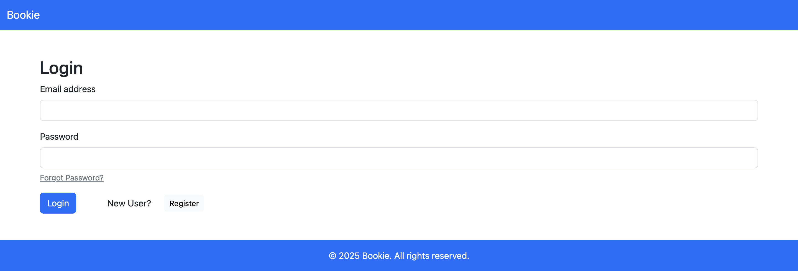
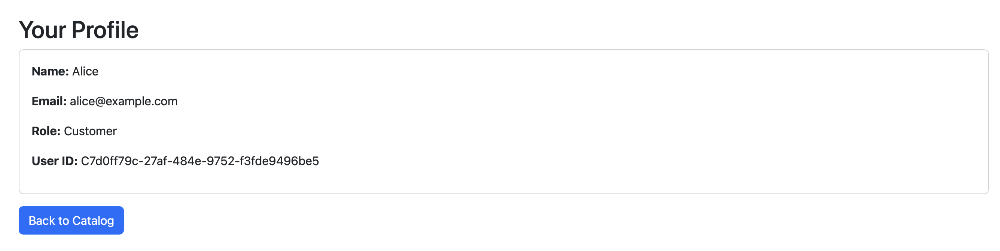
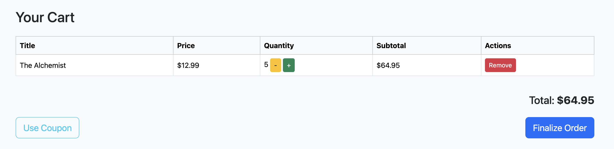
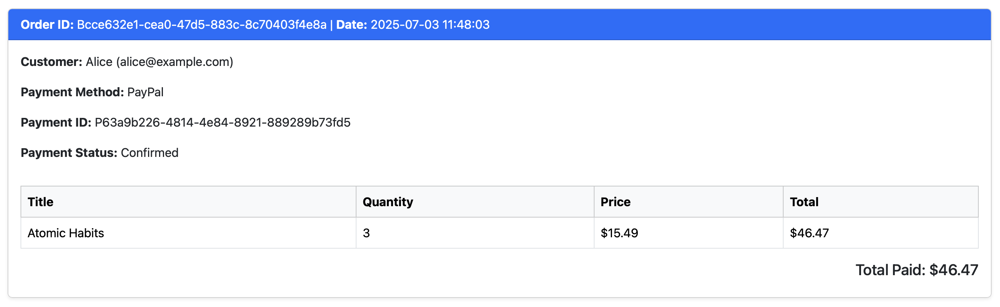
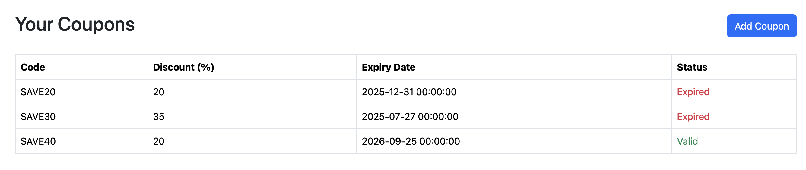

# DEMO

The book store application is a web-based platform that allows users to browse and purchase books online. It provides features such as user accounts, a book catalog, shopping cart, coupons, checkout, orders, and admin pages for managing the store.

* **Use-Case Diagram**:

* **Class Diagram**:

* **Home Page**:

* **Login Page**:

* **Profile Page**:

* **Carts Page**:

* **Purchases Page**:

* **Coupons Page**:
